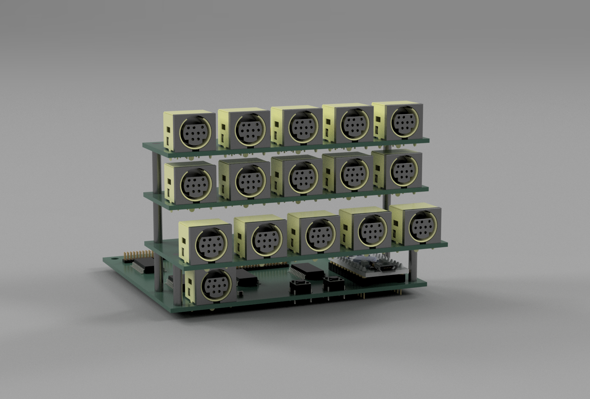

# OveRGBkill

*OveRGBkill* is an expandable analog RGB video switcher using common components.

# Warning

This is all hobbyist hardware and software, and could potentially damage your precious retro gaming equipment. It is provided "as is", without warranty of any kind, express or implied, including but not limited to the warranties of merchantability, fitness for a particular purpose, and noninfringement.

Be sure to scroll down for important notes integrating this into a real world AV system.

## Features

* Modular, up to 15 RGB inputs
* Standard Megadrive (MD2) style Mini-DIN 9 connectors
* Very compact, powered via USB 5V
* Sense and automatically switch to active input
* Routes R, G, B, and Composite video, Stereo audio Left, Right, Ground, and +5V. Other pins are not connected
* Extremely low cost per assembly for [parts](https://www.digikey.ca/en/mylists/list/I2IMYMPBML) (~US$20) and <100mm 4-layer PCB (~US$7)

Pairs well with a [HD Retrovision Genesis cable](https://www.hdretrovision.com/genesis) or my inferior [RGB-Component transcoder](https://github.com/partlyhuman/rgb-yuv-transcoder) if you have a TV with component input.

## Integrations

Some notes on how to wire your consoles for RGB output, from my experience. A good starting point is [RetroRGB](https://www.retrorgb.com/systems.html).

### RGB-capable systems

For systems that are already RGB capable but don't have an MD2 connector, such as Saturn, SNES, N64, Playstation 1/2, etc., I'll make an MD2 connector out of a SCART connector:

* Purchase an RGB-capable SCART connector
* Splice off the SCART head
* Disassemble the SCART head and use a SCART pinout to note which colour wire has which purpose. Many I've bought from AliExpress have this pinout *but you MUST verify for yourself* using a continuity tester
	* Yellow — Composite
	* Orange — Red
	* Green — Green
	* Blue — Blue
	* Brown — +5V
	* Purple — GND
	* Black — Audio GND
	* White — Audio Left
	* Red — Audio Right
* Use a Mini DIN-9 breakout PCB with a female Mini DIN-9 socket (the MD-90SM is ubiquitous)
	* For simple applications, something like [MobiusStripTech's breakout board](https://oshpark.com/shared_projects/amKj4zix) is great
 	* An even more compact option is [DB Electronics' breakout board](https://github.com/db-electronics/MD-90SM-breakout-kicad/releases/tag/0.1), specifically version 0.1.
	* To include AC coupling capacitors, voltage dividers and/or mono expansion, use the [breakout PCB](pcb/md2-rgb/) in this repository!
* A 3d printable shell finishes the cable. On one end you have a console-specific connector, on the other end you have a female MD2 connector, and use a straight Mini DIN-9 cable to wire this to your switcher.
 	* For the MobiusStripTech breakout, [this case](https://www.thingiverse.com/thing:3048576) works well
  	* If you use the DB Electronics breakout, I've [remixed the above case](https://www.thingiverse.com/thing:7306404)
   	* If using our breakout PCB, an accompanying shell is [here](3dp/md2-rgb), based on [sensorslot's project box template](https://github.com/SensorsIot/Project-Box-Templates/)

### SNES/SFC

Needs 220μF coupling capacitors on RGBC, use the  [breakout PCB](pcb/md2-rgb/) in this repository

### PS1/PS2

Needs 220μF coupling capacitors on RGBC, use the  [breakout PCB](pcb/md2-rgb/) in this repository

### Sega Genesis/Megadrive

Seems to use a much higher voltage, incorporate a voltage divider of around 1:2 on RGBC (for example R1=33Ω, R2=75Ω), using the breakout PCB or the customizable daughterboard.

### Arcade superguns

Many of these use 5V TTL CSYNC, incorporate a voltage divider of around 1:4  on C using the breakout PCB or the customizable daughterboard.

### Others

In general, if you have RGB modded your system, well designed mods will already use the correct voltages, AC coupling, and impedances, and I found that my RGB-modded PC Engine (doujindance) and NESRGB needed no further modification.

**Note** In fact it probably never hurts to add 220μF coupling capacitors on all inputs. This could be incorporated into future revisions of the daughterboard.

## Build considerations

### Daughterboard choice

Use the simple daughterboard if your inputs are standardized: if they're all AC-coupled (0 DC bias), with 75Ω impedance, and 0.7V peak-peak at 100 IRE.

You may use the customizable daughterboard to adjust voltages with voltage dividers built into the board. Or it may be more convenient to build these into your cables. It's your choice.

Of course you can also mix and match.

### Impedance Matching

A video buffer is integrated into the current revision of the hardware so that the switcher has typical 75Ω impedance.

### Cables

In the MD2 pinout, ground is carried over the shielding of a cable. Therefore, all mini-DIN 9 cables used with this must be shielded. Some cheap cables you may find on AliExpress skimp out on this, and it's not called out, so beware. Use a multimeter to check continuity between the metal outer ring of each end of the cable to verify you have shielded cables.

I can verify that (at the time I purchased them) these cables from "wg cable store" are shielded: [AliExpress](https://www.aliexpress.com/item/1005004607170871.html)
